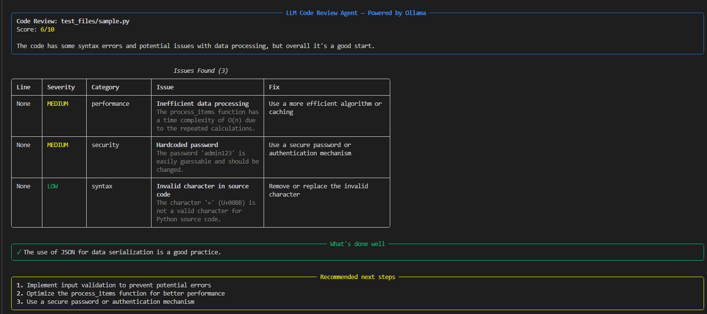
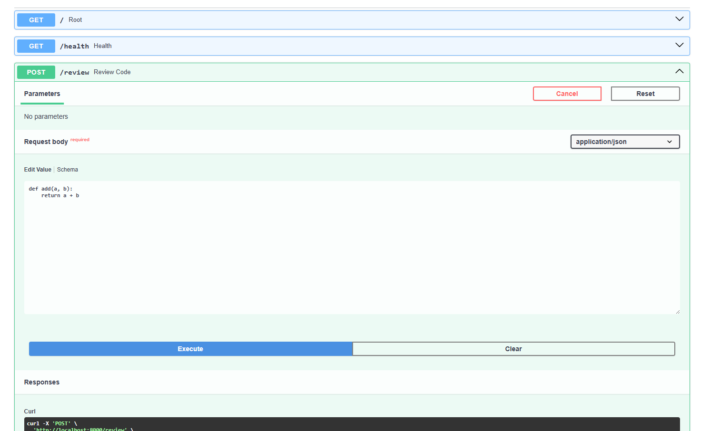
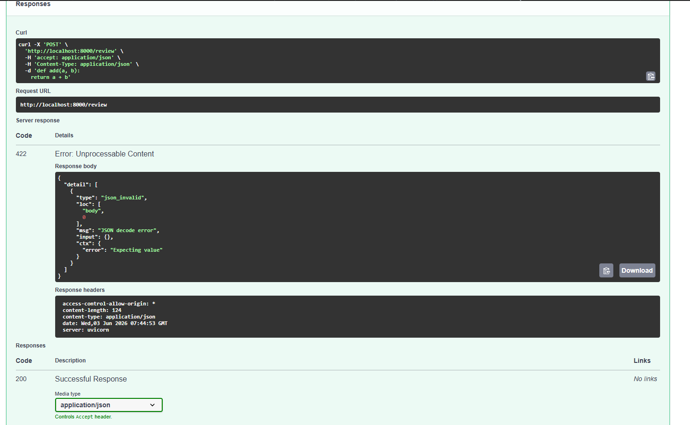

# LLM Code Review Agent

An AI-powered Python code reviewer that runs entirely locally using
Ollama — no API keys, no internet required, no cost.

## Demo

### CLI Output


### API Documentation


### API in Action


## How it works

1. **Static analysis** — Python's AST module extracts function names,
   line numbers, missing docstrings, and unused imports
2. **LLM inference** — structured analysis + raw code sent to a local
   LLaMA model via Ollama
3. **Structured output** — JSON review with per-issue severity,
   line numbers, and concrete fixes
4. **Rich display** — colour-coded terminal table sorted by severity
5. **REST API** — FastAPI endpoint so any app can consume reviews as JSON

## Setup

### 1. Install Ollama
Download from [ollama.com](https://ollama.com) and install.

Then pull the model:
```bash
ollama pull llama3.2
```

### 2. Clone and install
```bash
git clone https://github.com/Simrozechawla/code-review-agent
cd code-review-agent
python -m venv venv
venv\Scripts\activate
pip install -r requirements.txt
```

### 3. Run

**CLI:**
```bash
python reviewer.py path/to/your_file.py
python reviewer.py path/to/your_file.py --save output.json
```

**API:**
```bash
python api.py
# Open http://localhost:8000/docs
```

## Tech stack

- **Ollama + LLaMA 3.2** — local LLM inference, no API costs
- **Python AST** — static code analysis
- **FastAPI + Pydantic** — REST API with automatic request validation
- **Rich** — terminal colour formatting

## Why local inference?

Running the model locally means zero API costs, no rate limits,
and no code ever leaves your machine — important for reviewing
proprietary or sensitive codebases.
